🇬🇧 **English** · 🇷🇺 [Русский](GUIDE.ru.md)

# Build Your Own AI News Scout

### A practical guide to turning any fast-moving topic into a curated AI-assisted news system

> **Text status:** tutorial companion to the [AI-native Newsroom](README.md) framework. This guide explains the method; it does not require publishing any private runtime archive.

This guide shows how to build a small AI-assisted news portal for any topic: cybersecurity, climate tech, biotech, film technology, legal tech, developer tools, finance, education, fashion, or your local ecosystem.

The secret is not a bigger model. The secret is a clear editorial system.

A good news scout has three jobs:

1. **Watch** the right sources without making premature judgments.
2. **Curate** what matters using explicit domain rules.
3. **Remember** the best material as notes, examples, rules, and future editorial taste.

```mermaid
flowchart LR
    SRC["Sources<br/>RSS · websites · GitHub · social · APIs"]
    COL["Collector<br/>LLM-free capture"]
    RAW["Intake<br/>raw material"]
    CUR["Curator<br/>triage · taxonomy · format · guards"]
    PUB["Publication<br/>channel · site · newsletter"]
    HUMAN["Human editor<br/>taste · rating · decisions"]
    KB["Knowledge base<br/>notes · rules · toolkits"]

    SRC --> COL --> RAW --> CUR --> PUB --> HUMAN --> KB
    KB -.->|"rules + examples"| CUR

    classDef source fill:#ece9e1,stroke:#c2b89e,color:#2b2b2b
    classDef collector fill:#dbe2e9,stroke:#9fb3c0,color:#2b2b2b
    classDef curator fill:#e3ebd5,stroke:#a3bd86,color:#2b2b2b
    classDef channel fill:#e2ddee,stroke:#a99ec4,color:#2b2b2b
    classDef knowledge fill:#efe6d2,stroke:#cdb47e,color:#2b2b2b
    class SRC,RAW source
    class COL collector
    class CUR curator
    class PUB channel
    class HUMAN,KB knowledge
```



## Who this is for

Use this guide if you want to build:

- a Telegram channel, newsletter, or website that tracks a topic;
- an internal research radar for a team;
- a living knowledge base that grows from current events;
- a domain-specific AI scout that helps humans notice what matters.

Do not use it if you want a fully autonomous rumor machine. A good scout reduces manual load, but it does not remove editorial responsibility.

## The twelve stages

### 1. Define the domain promise

Do not start with tools. Start with the promise.

Weak: “Cybersecurity news.”

Better: “A practical radar for threats, tools, incidents, and defensive patterns that matter to product teams.”

The promise is the first guardrail. It tells both humans and agents what to ignore.

### 2. Describe the audience

Write a short audience card:

```yaml
audience:
  primary_reader: "who reads this"
  reader_job: "what work they do"
  reader_pain: "what is hard to track manually"
  reader_gain: "what they get from the scout"
  expertise_level: "beginner / practitioner / expert / mixed"
  tone: "fast, clear, useful, no hype"
```

A system that writes for everyone will publish for no one.

### 3. Build the source map

Separate sources by trust level:

| Source class | Examples | How to use |
|---|---|---|
| Primary | official blogs, docs, papers, changelogs, filings | source of truth |
| Secondary | expert commentary, newsletters, curated lists | context and interpretation |
| Discovery | social posts, GitHub trending, forums | leads, not final evidence |
| Noise | generic SEO summaries, copied news, vague predictions | usually drop |

A strong scout treats discovery as a lead, not as proof.

### 4. Create the taxonomy

Define four independent axes:

```yaml
domain_fit: [in_domain, adjacent, off_domain, general_noise]
topic_buckets: [release, tools, research, incidents, regulation]
content_shapes: [short-announcement, longform-article, file-only-note]
categories: [release, tutorial, benchmark, paper, case-study, opinion]
```

Do not mix these axes. A `release` can be a short announcement, a longform analysis, or a file-only note. A taxonomy works because each axis answers a different question.

### 5. Decide what belongs in the channel

The channel is not the archive. Publish only what helps the reader now.

| Candidate | Action |
|---|---|
| important, fresh, in-domain | publish |
| useful but too narrow | file-only note |
| broken capture | recapture |
| off-domain or recycled | drop |
| high-stakes claim without primary evidence | hold |

### 6. Define quality gates

Every domain needs explicit gates. For example:

```yaml
quality_gates:
  block_if:
    - capture_http_status >= 400
    - body_too_short
    - model_apology_instead_of_article
    - repeated_phrases
    - unreadable_encoding
    - off_domain
  require_human_review_if:
    - legal_claim
    - medical_claim
    - financial_claim
    - security_incident
```

Good gates are boring. That is why they work.

### 7. Design the content shapes

| Shape | Use when |
|---|---|
| `short-announcement` | a fresh release or simple update |
| `longform-article` | a substantive essay, guide, research result, or architecture lesson |
| `file-only-note` | useful for the knowledge base, not for public feed |
| `weekly-digest` | many small updates become one story |
| `monthly-snapshot` | the domain needs periodic state-of-the-field summaries |

Not every project needs every shape on day one. Start with one or two.

### 8. Separate collection from curation

The collector should capture material. It should not decide taste.

That separation is what keeps the system debuggable. If the page is broken, fix capture. If the judgment is wrong, fix domain rules. If the translation is broken, fix guards.

### 9. Build the human rating loop

After publication, the human editor should be able to rate the result:

| Rating | Meaning | Knowledge action |
|---|---|---|
| Excellent | reusable, toolkit-grade | promote to notes |
| Good | useful for the channel | keep in channel only |
| Normal | routine, not public-worthy | file or archive |
| Trash | noise or failure | drop / improve gates |

This loop turns editorial taste into future system memory.

### 10. Create the knowledge loop

The best posts should not die in the feed. Promote them into:

```text
notes/<topic_bucket>/
knowledge-base/toolkits/
prompts/
runbooks/
examples/
```

The knowledge base should contain stable patterns, not every passing detail.

### 11. Add agent instructions

Agents need more than prose. Give them a domain brief, source registry, triage rules, quality gates, output format, examples of good and bad decisions, and a definition of done.

Ready-to-fill templates for all of these live in the companion repo, **[ai-newsroom-agent-configs](https://github.com/USER/ai-newsroom-agent-configs)** <!-- FILL: real URL of the companion repo -->.

### 12. Launch small, then expand

Start with one domain, ten to thirty sources, one publishing channel, one or two content shapes, and a human review loop. Add more only after the failure modes are visible.

## The nine domain-pack slots

The twelve stages above are the *order of work*. This is the *checklist of what a domain pack actually contains* — the nine things you fill in when the engine stays the same and only the topic changes. Think of them as the variable part of the system; everything else is invariant.

1. **Domains and channels.** How many channels, and how captures are routed between them. One topic → one channel; a compound topic → sub-channels by domain fit. Decide the routing asymmetry up front (e.g. one channel keeps only its own domain and fail-closed-drops the rest, while another accepts a cross-domain category).
2. **Truth-unit model.** The most important and *least universal* choice. Is the unit of durable knowledge an assembled **toolkit** (toolkit-first), or a **per-topic file** with toolkits as a derived export (topic-first)? It depends on who consumes the knowledge — a human reading one assembled document, or an agent routing quickly by topic. Choose deliberately; do not inherit it by reflex.
3. **Taste rubric.** One decisive heuristic plus positive/negative signals plus a few-shot set. (Example heuristic: *"still teaches how to do something six months from now → excellent; value is only in the fact of a release → normal."*) The rubric is the core of editorial judgment — see *Calibrating taste* below.
4. **Taxonomy: topic buckets ↔ knowledge units.** The list of canonical buckets and a **1:1 contract**: the evidence bucket name equals the truth-unit name. Allow, by design, a fallback bucket with no toolkit and a process toolkit with no bucket.
5. **Source layers.** Three layers — official / practitioner / signal (aggregator) — in a machine-readable registry with a job family and a lane. Add topic-specific anti-duplication terms *before* widening the source set, or one release multiplies through mirrors.
6. **Content shapes.** Which forms are live: longform / short announcement / digest / snapshot. The hard lesson: **do not build all shapes at once.** Start with longform + short. Shape viability depends on the tempo of the topic, not the engine.
7. **Cadence lanes.** Assign every source a polling lane — radar (frequent, hot), evergreen (slow), daily (an expensive social/long-tail watchlist). Rare-but-good authors who post every few months belong on the daily lane, not on frequent polling.
8. **Routing / drop policy.** What drops before translation (a cost gate on noise), what goes to a file instead of the channel (vendor references), what de-duplicates by release key. Rule: off-domain → drop; noise → drop before paying for translation; vendor reference → file, not channel.
9. **Prompt pack — the most fragile boundary.** Role, audience, editorial policy, glossary, templates, channel identity. This is **domain-specific and must not be shared between topics.** It is the easiest thing to copy and forget to rewrite when cloning the engine onto a new topic — the channel then speaks in the wrong voice, and it is not noticed immediately. **Write the prompt pack from scratch for the topic; this is the first check when launching a new channel.**

## Calibrating taste without training weights

You do not fine-tune a model to get good editorial taste. You instruct it and then examine it. Three independent levers:

- **A reference channel as a signal, not ground truth.** Pick a strong human curator in your topic. Measure your coverage against them — but do **not** copy them 1:1 or optimize for 100% overlap; some of what they publish, you would reject. The goal is *quality at their level*, not exact match. Track an *independence* metric (your coverage with the reference turned off) to see whether you have become a real source or just a mirror.
- **A golden evaluation set as the exam for changing models.** A small labelled set does double duty: it supplies few-shot examples *and* it is the exam any model swap must pass. Run triage over it, read the confusion matrix, and tune the **rubric**, not the model. (Real example from the reference system: a model swap was gated on a 338-item golden set, where the chosen model scored meaningfully higher *and* cost several times less — the eval, not a vibe, made the call.)
- **Manual rating, decoupled from auto-triage.** A few rating buttons under each published post. The rating does **not** gate publication (the post is already live); it accumulates for future learning. Rules: one item = one record; a human rating always overrides the model; changing a rating changes the route. Early on, keep triage **conservative about "trash"** — send borderline items to "normal" (a human will see and fix), not to "trash" (a human will not).

The supply loop that ties this together is a manual gradient descent: **baseline (audit) → one hypothesis ("if X then ΔY") → one change + commit → wait one collector cycle → re-measure → keep or revert.** Balance five metrics at once — coverage, precision, latency, source diversity, independence — without chasing one at the expense of the rest.

## A bootstrap sequence (Phase 0–8)

- **Phase 0 — Contract and reference.** State the topic, find one or two reference curators, choose the truth-unit model (slot 2) and the number of channels. Write down: "the pack is swappable, the engine is shared."
- **Phase 1 — Domain-pack skeleton.** Stand up a second config (domain, port, database, channel credentials, knowledge root). **Write the prompt pack from scratch** — do not copy another topic's. Define the taxonomy (5–11 buckets), the bucket→toolkit mapping, and the drop policy.
- **Phase 2 — Taste rubric + golden set.** Write the decisive heuristic and the positive/negative signals. Assemble a starter labelled set (even by hand from the reference channel) — it is both few-shot and exam. Run triage over it, build the confusion matrix, tune the rubric to a high match. Only then go live.
- **Phase 3 — Source registry + lanes.** Fill the machine-readable registry: official / practitioner / signal layers, job family, lane. Add the reference channel as a curated aggregator. Add anti-duplication terms before widening.
- **Phase 4 — Collector in quarantine mode.** Start collection, watch intake and source-health. Check capture quality on client-rendered pages; honestly hold dead / SPA sources rather than letting them rot silently. The channel does not publish yet.
- **Phase 5 — Pipeline on one shape.** Longform + short only, with the guards in place (degeneration + structural + outbound). First posts under observation; manual ratings accumulate.
- **Phase 6 — Calibrate on the live stream.** Coverage audit against the reference; manual ratings → divergence matrix. Turn on the cost gate, the de-dup ledger, and file-only routing. Choose the cloud model with a golden-set run.
- **Phase 7 — Knowledge loop.** Promote "excellent" into notes, accumulate, then hand-assemble the first toolkits. Honour the "bucket name = unit name" contract.
- **Phase 8 — Supply evolution (slow).** Move from "mirror of the reference" toward independence: widen the registry, add a narrow paid social watchlist (not a broad fan-out), run the independence test, and only later attempt autonomous source discovery behind a precision gate.

## What transfers, and where it breaks

**Transfers better than expected:**

- The engine is genuinely domain-agnostic. Two live channels on different topics, one source tree, second config. Fix the engine once, both topics benefit.
- The knowledge contract transfers verbatim: notes ↔ toolkit, "bucket name = unit name", promote only on "excellent".
- The supply methodology is purely procedural — reference-as-signal, golden-eval gate, one-change-per-experiment — the topic does not enter it at all.
- The delivery guards are fully topic-independent: they defend against *model behaviour* (degeneration, structural failures), not against the subject.

**Does not transfer / breaks at the seam:**

- **The truth-unit model is not universal** (slot 2). Toolkit-first and topic-first are different contracts; the choice depends on who consumes the knowledge.
- **The prompt pack is the most fragile boundary** (slot 9). The classic failure is inheriting another topic's role and identity. Write it from scratch.
- **Content-shape viability is topic-dependent** (slot 6). A digest can be dead weight on a fast topic and the primary shape on a slow one.
- **A shared engine is a shared risk.** The price of portability is config drift and cross-runtime duplicates. The countermeasures (per-domain smoke tests, config fingerprinting) are mandatory from day one, not "later."

**In one line:** the system is roughly *engine + process* portable; the remaining part — taste rubric, taxonomy, and (critically) the prompt pack — must not be copied between topics.

## Adapting to another domain — four worked examples

The engine stays; only the domain pack changes. Here is what four different topics look like — promise, key sources, special rules. This is the concrete answer to "but how would it work on *my* topic."

**A. Cybersecurity.** Promise: practical threats, tools, incidents, and security releases that matter to engineering and security teams. Sources: CVE/NVD, GitHub Security Advisories, CISA KEV, vendor blogs, research-team reports, changelogs. Special rules: never publish exploit instructions; do not exaggerate risk; always include affected products, versions, severity, and a primary source.

**B. Climate and energy.** Promise: technologies, regulation, infrastructure, investment, and applied research. Sources: regulators, energy agencies, scientific publications, company announcements, patents, infrastructure projects. Special rules: separate scientific evidence from press releases; do not mix policy, markets, and engineering facts; label forecasts carefully.

**C. Scientific radar.** Promise: turn a stream of papers into clear notes — what was done, why it matters, how reliable it is, and what is not yet proven. Sources: arXiv, PubMed, DOI pages, journals, labs, conferences. Special rules: a preprint is not peer-reviewed; word claims carefully; treat methods, data, limitations, and reproducibility separately.

**D. Film, animation, virtual production.** Promise: how AI, real-time graphics, cameras, virtual stages, and generative tools reshape visual production. Sources: studio blogs, tool vendors, conferences, GitHub, demo reels, interviews, release notes. Special rules: separate real production workflows from impressive demos; flag rights, licensing, and ethical constraints.

## The one test

When the domain pack feels done, ask one question:

> If the owner does not open the chat for a week, will the agent still understand what to collect, what to reject, what to publish, what to keep as knowledge, and when to call a human?

If yes, the pack is well designed. If no — **do not add another model, add clearer rules.**

## Minimal launch checklist

- [ ] Domain promise is written.
- [ ] Audience card exists.
- [ ] Source map is separated into primary / secondary / discovery / noise.
- [ ] Taxonomy has domain fit, topic buckets, content shapes, and categories.
- [ ] Quality gates are explicit.
- [ ] Human rating loop is defined.
- [ ] Knowledge promotion rule is defined.
- [ ] Agent appendix exists.
- [ ] Public repository is sanitized (see [`docs/publication-safety.md`](docs/publication-safety.md)).

## The template you actually need

A new topic begins with one file. The canonical version is `templates/DOMAIN_BRIEF.template.yml` in the companion repo; the shape is:

```yaml
domain_pack:
  name: ""
  promise: ""
  audience: ""
  not_for: ""

sources:
  primary: []
  secondary: []
  discovery: []
  reject: []

taxonomy:
  domain_fit: []
  topic_buckets: []
  content_shapes: []
  categories: []

publishing:
  channel: ""
  cadence: ""
  human_review_required_for: []

knowledge_loop:
  promote_when: ""
  notes_path: "notes/<topic_bucket>/"
  toolkit_refresh_trigger: ""
```

The rest is iteration.

---

**See also:** [framework overview](README.md) · [design patterns](docs/patterns.md) · [real-world case study](docs/case-study.md)
