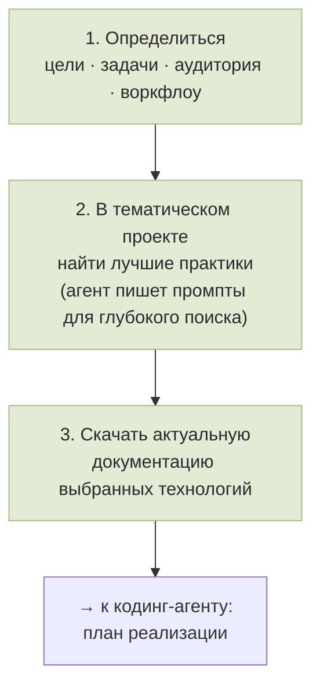

🇬🇧 [English](GUIDE.md) · 🇷🇺 **Русский**

# Как построить собственную обновляющуюся базу знаний по AI

### Практическое руководство: из быстро меняющейся темы — в кураторскую, всегда-актуальную базу знаний

---

## Архитектура одним взглядом

```mermaid
flowchart LR
    SRC["Источники<br/>радар · evergreen · daily"]
    COL["Коллектор<br/>без LLM: захват + чистка"]
    CUR["Куратор<br/>LLM: оценка · тема · перевод · гарды"]
    CH["Публикация<br/>канал · сайт · рассылка"]
    KB["База знаний<br/>статьи + тулкиты"]

    SRC -->|"страница"| COL
    COL -->|"чистый markdown"| CUR
    CUR -->|"готовый пост"| CH
    CH -.->|"оценка / отбор агентом"| KB
    KB -.->|"знания + промпты"| CUR

    classDef raw fill:#ece9e1,stroke:#c2b89e,color:#2b2b2b
    classDef col fill:#dbe2e9,stroke:#9fb3c0,color:#2b2b2b
    classDef cur fill:#e3ebd5,stroke:#a3bd86,color:#2b2b2b
    classDef ch fill:#e2ddee,stroke:#a99ec4,color:#2b2b2b
    classDef kb fill:#efe6d2,stroke:#cdb47e,color:#2b2b2b
    class SRC raw
    class COL col
    class CUR cur
    class CH ch
    class KB kb
```

Материал движется слева направо: сборщик снимает страницы с заданных площадок, чистильщик приводит их к
единому виду, куратор с участием LLM решает судьбу каждого материала — и лишь отобранное публикуется и
попадает в долговременную базу. Особенность темы AI — скорость устаревания: статичная база теряет смысл за
недели, поэтому **обновление встроено в саму конструкцию**, а не делается вручную.

---

## Из чего состоит система

**Сбор данных.** Информация собирается по заранее отобранному списку авторов — список по ходу работы
пересматривается. Под каждый тип площадки — свой способ обработки. Сам сбор делает не LLM, а отдельные
механизмы под разные источники. Перед добавлением источник проверяют и тестируют: как его лучше забирать.
Дальше — очистка от шума и сохранение готовых чистых статей в формате `.md`. LLM подключается только на
следующем этапе, в работе с уже собранными статьями.

Технически захват — обычный конвейер веб-скрейпинга, без всякого «понимания» текста:

1. **Скачивание** страницы обычным HTTP-запросом (`requests`).
2. **Извлечение по правилам** — из HTML (`BeautifulSoup`) достаётся тело статьи, отбрасываются меню, реклама
   и подвал.
3. **Приведение к Markdown** (`markdownify`) с постобработкой и контролем длины.
4. **Детерминированные фильтры** — хватает ли текста, не login-wall ли это, не пустая ли JS-оболочка.
5. **Дедуп по URL**, чтобы один материал не зашёл дважды.

Каждому источнику назначается своя **дорожка опроса**: *радар* — горячее, часто; *evergreen* — медленно;
*daily* — раз в день, для социальных сетей и редких, но ценных авторов (кто публикует раз в пару месяцев —
такому частый опрос не нужен).

> **Зачем разделять захват и суждение.** Если пускать модель уже на сбор, её ранние догадки загрязняют
> исходный слой: испорченный захват начинает выглядеть как нормальный материал. Чистое сырьё позволяет
> принимать редакторское решение с контекстом, а не наследовать скрытую догадку модели. Эта же граница
> делает систему **отлаживаемой**: сломалась страница — чинят захват; неверное суждение — правят правила
> домена; поплыл перевод — правят гарды.

**Добавление источника.** Сначала определяют тип источника, способ обработки и точки входа — обычно это блог
или страницы, куда падают новости и релизы. Поиск и тестирование точек входа берут на себя агенты: они
проверяют и решают, оставить точку входа или заменить. Если агенты не справляются — подключаются сторонние
сервисы.

Когда в теме ещё нет ориентиров, базу источников набирают итеративно:

1. **Стартовый список ссылок.** Можно попросить LLM сразу; можно сначала попросить её написать запрос для
   самой себя, затем исполнить.
2. **Проверка и классификация.** Агенты проходят по списку и раскладывают источники по классам: *официальные*
   (сайты компаний, страницы продуктов); *обзорщики и арены* (тесты, сравнения, бенчмарк-лидерборды);
   *практики* (люди, работающие с продуктом и пишущие об этом, включая глубокий разбор на своём воркфлоу).
   Критерии: релевантность, качество материалов, живость обсуждения, доля рекламы, польза.
3. **Снежный ком.** У знающих авторов обычно есть свои ссылки и рекомендации — проходят по доверенным
   источникам и повторяют проверку.
4. **Расширение по качеству.** Собранное прогоняют через web-LLM, выделяют опорные и авторитетные источники,
   а затем просят найти **ещё такого же качества**, чего в базе нет (примеры у модели уже есть — планка
   понятна). Новый список верифицируют по той же схеме и сливают с базой.

**Курирование и публикация.** Собранные статьи просматривают, отбирают, категоризируют и публикуют в
тематический Телеграм-канал — со ссылками, авторами и переводами. По возможности материалу проставляют
оценку: механизм особенно помогал на старте канала. Со временем система работает устойчивее и сама, а
хороших статей становится больше, чем редактор успевает оценивать.

**Перевод.** Перевод, категоризацию и оценку статей делает одна и та же **недорогая облачная модель** —
выбранная прогоном на собственном материале, по балансу цены и качества. Чтобы перевод был человекочитаемым,
нужен свод правил и глоссарий по теме. Несколько дешёвых моделей приходится отсеивать: они слишком сжимают
статью, и вместо статьи выходит короткий пересказ. Очень длинные тексты бьются на части (ограничение
Телеграфа) и публикуются под номерами в одном посте.

**Работа с опубликованным.** Следующий шаг — более автоматизированная работа с уже отобранными статьями через
AI. Базовый механизм уже есть, но запускается по запросу: агенты проверяют новые статьи, при необходимости
правят категории и сохраняют в базу знаний.

**База знаний и тулкиты.** С базой можно работать на двух уровнях: открывать полные статьи для глубокого
погружения и держать рядом тулкиты — краткие выжимки по нужным срезам темы разработки с AI.

**Обратная связь и калибровка.** В системе есть небольшое звено обратной связи — человеческие оценки статей;
особенно оно важно в начале, пока отбор притирается к предпочтениям. Когда накапливается большой массив
данных, перед настройкой агента на отбор и категоризацию прогоняют сверку: насколько его результаты
совпадают с тем, что выбрал бы сам потребитель контента. По расхождениям правят промпт или меняют модель —
пока оценки не сойдутся.

---

## Применение

1. **Прямой поиск агентами по базе.**
2. **Система проектов Claude и ChatGPT.** Под конкретную тему собирают мини-базу знаний: загружают готовые
   тулкиты и добавляют надстройку — быстрый поиск, краткое досье (профиль, предпочтения, цели и задачи) и
   один-два вводных документа (что-то вроде скилла или подробного промпта): как устроена система, в каком
   порядке решать вопросы и как модели в ней ориентироваться. После этого модель входит в тему с нужной
   глубиной контекста и помогает решать задачи.

Перед тем как идти к кодинг-агенту за планом реализации, удобны **три шага**:

С результатами этих шагов и свежей документацией на руках строится план реализации. Это полный цикл — от
сбора знаний до их применения.

---

## Стоимость и практические нюансы

- **Дорогая модель — это статья расходов.** На отборе и переводе разумнее недорогая облачная модель,
  выверенная на тестах, чем «самая мощная по умолчанию».
- **Поток масштабирует затраты.** Чем шире набор источников и чем больше проходит годного, тем дороже
  обработка; при заметном объёме «почти бесплатно» через API не выйдет.
- **Локальная модель — размен.** Она убирает плату за токены, но упирается в железо и теплоотвод (на
  ноутбуке шум становится осязаемой проблемой; стационар в стороне от спального места переносит это
  спокойнее). И ещё: модель, которой хватает на сортировку, **не факт, что вытянет перевод** — это проверяется
  отдельно.

---

## Ограничения

- это **не полностью автономная редакция** — человек не выводится из контура;
- ошибки возможны;
- **под каждую новую тему систему приходится донастраивать** — универсального «включил и работает» нет;
- всё держится на качестве источников;
- проверено на небольшом масштабе и нескольких темах: это говорит о переносимости частей, но не о всеобщей
  применимости;
- открытая версия **не воспроизводит рабочий контур целиком**: секреты, журналы, базы и личные данные
  остаются за кадром.

---

## Главный принцип

Сила такой системы — не в том, чтобы **затаскивать больше**, а в том, чтобы **увереннее отсекать лишнее**,
фиксировать обоснование каждого решения и оставлять окончательный выбор за человеком. Автоматика снимает
повторяющийся труд, но взамен требует предельно ясно сформулировать собственные критерии качества.

---

## Материалы

- 🗞️ **AI-native Newsroom** — этот репозиторий: фреймворк и методология.
- ⚙️ **AI Newsroom Agent Configs** — очищенные шаблоны для адаптации под свою тему:
  [github.com/SoulAtelier/ai-newsroom-agent-configs](https://github.com/SoulAtelier/ai-newsroom-agent-configs)
