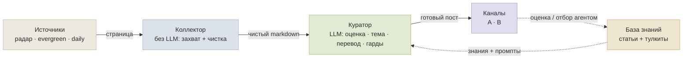
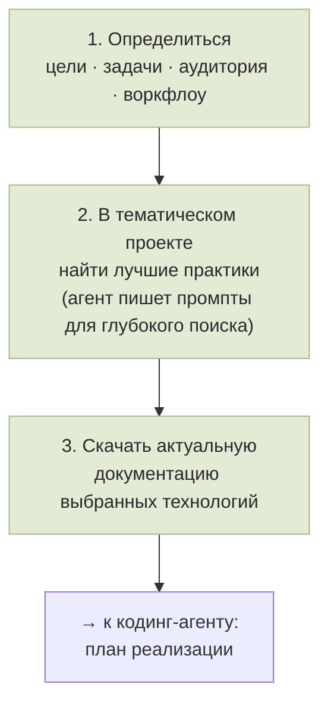

🇬🇧 [English](GUIDE.md) · 🇷🇺 **Русский**

# Методология: самообновляющаяся база знаний по разработке с AI

> Русская версия методички, в которой раскрывается, как устроена наша система и как собрать подобную. Английский гайд — [GUIDE.md](GUIDE.md).

---

## Задача

Такая система решает одну задачу: держать **техническую базу знаний по быстро меняющейся теме в актуальном
состоянии** — без ежедневного ручного перелопачивания лент. От неё требуется пять вещей: непрерывно
наблюдать за заданным набором источников, отделять значимое от фонового шума, блокировать заведомо
испорченные материалы, складывать ценное в долгую память и оставлять финальное слово за человеком.

Главная особенность темы AI — скорость устаревания: статичная база теряет смысл за недели. Поэтому
**обновление встроено в саму конструкцию**, а не делается вручную.

---

## Архитектура одним взглядом

Материал движется слева направо: детерминированный сборщик снимает страницы с заданных площадок,
чистильщик приводит их к единому виду, куратор с участием LLM решает судьбу каждого материала, и лишь
отобранное публикуется и попадает в долговременную базу. Набор отслеживаемых площадок и авторов хранится в
реестре и со временем пересматривается; под каждый тип площадки — свой способ захвата и предочистки.

---

## Сбор данных — без LLM

Захват материала намеренно построен **без участия языковой модели**. Логика простая: модель нужна там, где
требуется *понять* текст (ценен ли он, о чём он, куда его), а скачать страницу и срезать с неё обвес —
задача без всякого понимания, её десятилетиями решают обычные средства веб-скрейпинга:

1. **Реестр источников задан заранее** (кто, откуда, как часто). Ведёт его человек/процесс, не модель.
2. **Расписание (дорожки):** планировщик обходит источники по таймеру — горячее чаще, блоги реже, твиттер
   и редкие лонгриды раз в день.
3. **Скачивание** — обычный HTTP-запрос (`requests`).
4. **Извлечение по правилам** — HTML разбирается (`BeautifulSoup`), достаётся тело статьи, отбрасываются
   меню, реклама, подвал.
5. **Приведение к Markdown** — `markdownify` + постобработка + контроль длины.
6. **Детерминированные фильтры** — хватает ли текста? не login-wall? не пустая JS-оболочка? — по простым
   сигналам, а не «на глаз».
7. **Дедуп** по URL.

Сборщик **не выносит вердиктов о ценности и теме**. Его дело — стабильно достать и очистить то, что лежит по
известным адресам, и положить в очередь. Всё, что требует суждения — оценка, тема, маршрут, — это уже
куратор, и именно он обращается к LLM.

> **Зачем разделять захват и суждение.** Если пускать модель уже на сбор, её ранние догадки загрязняют
> исходный слой: испорченный захват начинает выглядеть как нормальный материал. Чистое сырьё позволяет
> принимать редакторское решение с контекстом, а не наследовать скрытую догадку модели.

---

## Добавление источников и холодный старт

Подключение новой площадки начинается с разбора: к какому типу она относится и как с неё забирать материал.
На практике это сводится к поиску **точек входа** — страниц, на которые ложатся свежие записи: ленты блога,
разделы релизов, страницы анонсов. Сам разбор, прогон тестовых захватов и вывод «точка рабочая / нужна
другая» хорошо ложатся на агентов. Там, где прямой захват невозможен по техническим причинам —
характерный случай Twitter, закрытого для обычного скрейпинга, — в дело вступает внешний сервис.

**Холодный старт базы источников**, когда в теме пока нет ориентиров — рабочая итерационная процедура:

1. **Стартовый список ссылок.** Можно попросить LLM сразу; можно сначала попросить её написать запрос для
   самой себя, затем исполнить.
2. **Проверка и классификация.** Агенты проходят по списку и раскладывают источники по классам:
   *официальные* (сайты компаний, страницы продуктов); *обзорщики и арены* (тесты, сравнения,
   бенчмарк-лидерборды); *практики* (люди, работающие с продуктом и пишущие об этом, включая глубокий
   разбор на своём воркфлоу). Критерии: релевантность, качество материалов, живость обсуждения, доля
   рекламы, польза.
3. **Снежный ком.** У знающих авторов обычно есть свои ссылки и рекомендации — проходим по доверенным
   источникам и повторяем проверку.
4. **Расширение по качеству.** Прогнать собранное через web-LLM, выделить опорные/авторитетные, а затем
   попросить найти **ещё такого же качества**, чего в базе нет (примеры у модели уже есть — планка
   понятна). Новый список верифицируем по той же схеме и сливаем с базой.

---

## Курирование и публикация

На этом слое поток проходит ревизию: явный мусор отбрасывается, остальное раскладывается по рубрикам и
готовится к выходу. Здесь и включается LLM — причём не только для рубрикации: она же выносит **оценку
качества** (сильный материал / слабый / мусор), определяет **тему и целевой канал** и выполняет **перевод**.

Куда выводить результат — дело вкуса. Удобная связка — Телеграм плюс Телеграф: в Телеграф ложится перевод
полной статьи. Несколько практических замечаний по переводу:

- переводит та же LLM (на момент написания — недорогая облачная; точное имя быстро устаревает);
- без **свода правил и глоссария** по теме перевод начинает плыть;
- модель под перевод стоит выбирать прогоном на собственном материале: дешёвые варианты порой **ужимают
  статью до пересказа**, роняют детали или фантазируют;
- слишком длинные тексты приходится резать на части (предел Телеграфа) и публиковать пронумерованными.

---

## База знаний и тулкиты

С готовой базой можно работать на двух глубинах: открывать **полные статьи**, когда нужно разобраться
детально, и держать рядом **тулкиты** — сжатые конспекты по выбранным срезам темы.

Тулкиты ценны не только как материал для поиска кодинг-агентами. Под разбор задачи или прикидку нового
проекта удобно завести **тематический проект** в чат-платформе (системы проектов есть и у Claude, и у
ChatGPT): закинуть туда все тулкиты по теме и надстроить над ними тонкий слой управления —

- быстрый поиск по тулкитам;
- краткое досье: кто я, что предпочитаю, какие цели и задачи;
- один-два **вводных документа** (по сути — скилл или развёрнутый промпт): как устроена эта система, в каком
  порядке решать вопросы и как модели в ней ориентироваться.

После этого модель входит в тему с нужной глубиной контекста. Перед тем как идти к кодинг-агенту строить
план реализации, удобны **три шага**:

С результатами этих шагов и свежей документацией на руках строится план реализации. Это полный цикл: от
сбора знаний — до их применения в новом проекте.

---

## Обратная связь и калибровка

В контуре есть негромкая, но важная **петля обратной связи** — человеческие оценки материалов; особенно она
работает на старте, пока отбор только притирается к вкусу.

Когда данных накапливается достаточно, агента не настраивают «вслепую»: сначала прогоняют **сверку** —
насколько его отбор совпадает с тем, что выбрал бы сам человек-потребитель контента. По расхождениям правят
промпт или меняют модель, и так до схождения. Кстати, именно из-за этой потребности в накопленном тестовом
наборе **подобную систему не собрать за неделю** — сперва нужно накопить данные для калибровки.

---

## Стоимость и практические нюансы

- **Дорогая модель — это статья расходов.** На отборе и переводе разумнее недорогая облачная модель,
  выверенная на тестах, чем «самая мощная по умолчанию».
- **Поток масштабирует затраты.** Чем шире набор источников и чем больше проходит годного, тем дороже
  обработка; при заметном объёме «почти бесплатно» через API не выйдет.
- **Локальная модель — размен.** Она убирает плату за токены, но упирается в железо и теплоотвод (на
  ноутбуке шум становится осязаемой проблемой; стационар в стороне от спального места переносит это
  спокойнее). И ещё: модель, которой хватает на сортировку, **не факт, что вытянет перевод** — это проверяется
  отдельно.

---

## Ограничения

- это **не полностью автономная редакция** — человек не выводится из контура;
- ошибки возможны;
- **под каждую новую тему систему приходится донастраивать** — универсального «включил и работает» нет;
- всё держится на качестве источников;
- проверено на небольшом масштабе и нескольких темах: это говорит о переносимости частей, но не о всеобщей
  применимости;
- открытая версия **не воспроизводит рабочий контур целиком**: секреты, журналы, базы и личные данные
  остаются за кадром.

---

## Главный принцип

Сила такой системы — не в том, чтобы **затаскивать больше**, а в том, чтобы **увереннее отсекать лишнее**,
фиксировать обоснование каждого решения и оставлять окончательный выбор за человеком. Автоматика снимает
повторяющийся труд, но взамен требует предельно ясно сформулировать собственные критерии качества.

---

## Материалы

- 🗞️ **AI-native Newsroom** — этот репозиторий: фреймворк и методология.
- ⚙️ **AI Newsroom Agent Configs** — очищенные шаблоны для адаптации под свою тему:
  [github.com/SoulAtelier/ai-newsroom-agent-configs](https://github.com/SoulAtelier/ai-newsroom-agent-configs)
