# AI-native Newsroom

### A reusable framework for turning fast-moving signals into curated channels and living knowledge

> **Text status:** public-facing synthesis from the working two-channel system. This is not a dump of the runtime. Secrets, logs, raw intake, databases, and private operational files stay out of the public repository — see [`docs/publication-safety.md`](docs/publication-safety.md).


-2b2b2b)

AI moves faster than a human knowledge base can be updated by hand.

AI news is not a lack-of-information problem. It is an overload problem. Every day brings model releases, changelog fragments, API changes, agent patterns, vendor docs, benchmarks, essays, demos, and half-truths. A human can read some of it. A generic bot can summarize some of it. Neither is enough if you want an editorial system that can notice useful signals, reject noise, publish cleanly, and turn the best material into durable knowledge.

**AI-native Newsroom** is a framework for building small, topic-specific editorial systems with AI agents. It is distilled from the working two-channel architecture: one collection layer, one curation/publishing layer, and one knowledge loop.

```text
sources → LLM-free capture → triage → routing → translation/editing → guards → publication → human rating → notes → toolkits
```

The goal is not to replace editors. The goal is to give one editor, one researcher, or a small team **an editorial machine with a long memory** — one that keeps watch while a human keeps taste.

## What this framework is

A pattern for AI-native editorial infrastructure:

| Layer | Role | Design principle |
|---|---|---|
| Collector | captures raw material | no LLM, no judgment, no magic |
| Curator | decides what deserves attention | domain rules, taxonomy, guardrails |
| Publisher | turns selected material into posts | format-aware, channel-aware, fail-closed |
| Human editor | rates and promotes material | taste and trust stay human |
| Knowledge base | keeps the best discoveries | notes, toolkits, prompts, rules |

The key idea is simple:

> **A new topic should be a new domain pack, not a fork of the system.**

The same scaffold can support AI engineering, generative media, cybersecurity, climate tech, biotech, film technology, legal tech, local news, or any other domain where the signal moves faster than a person can comfortably track.

## System overview

```mermaid
flowchart LR
    SRC["Sources<br/>RSS · websites · GitHub · social · APIs"]
    COL["Collector<br/>LLM-free capture"]
    RAW["Intake<br/>raw material"]
    CUR["Curator<br/>triage · taxonomy · format · guards"]
    PUB["Publication<br/>channel · site · newsletter"]
    HUMAN["Human editor<br/>taste · rating · decisions"]
    KB["Knowledge base<br/>notes · rules · toolkits"]

    SRC --> COL --> RAW --> CUR --> PUB --> HUMAN --> KB
    KB -.->|"rules + examples"| CUR

    classDef source fill:#ece9e1,stroke:#c2b89e,color:#2b2b2b
    classDef collector fill:#dbe2e9,stroke:#9fb3c0,color:#2b2b2b
    classDef curator fill:#e3ebd5,stroke:#a3bd86,color:#2b2b2b
    classDef channel fill:#e2ddee,stroke:#a99ec4,color:#2b2b2b
    classDef knowledge fill:#efe6d2,stroke:#cdb47e,color:#2b2b2b
    class SRC,RAW source
    class COL collector
    class CUR curator
    class PUB channel
    class HUMAN,KB knowledge
```



The architecture separates **capture from judgment**. The collector stores raw Markdown. The curator/publisher performs triage, discovery, routing, translation, guard checks, and delivery. The knowledge base preserves prompts, notes, process docs, and toolkit-grade knowledge.

For the concrete two-channel system this framework was distilled from — with the full production pipeline — see [`docs/case-study.md`](docs/case-study.md).

## Why this design works

### 1. The collector is intentionally boring

The collection layer does not decide whether something matters. It fetches, normalizes, writes intake, and records capture health. This makes the raw layer cheap, inspectable, and less likely to smuggle model opinion into the evidence layer.

### 2. The curator owns judgment

The curator layer knows the domain. It can ask: Is this in scope? Is it a release, a tutorial, a benchmark, a vendor doc, an incident, or a useful essay? Does it belong in a public channel, a file-only archive, or the trash?

### 3. Publication is not knowledge

A public post is a delivery event. A knowledge note is a reusable memory object. The best systems do not treat those as the same thing. Public posts can be fast, but durable knowledge requires a stronger signal.

### 4. The system fails closed

Broken captures, 404 pages, thin bodies, model apologies, mojibake, CJK leakage, empty pages, off-domain content, and broad industry noise should not become public output. The publishing surface is treated as a product, not a debug console.

These four ideas, plus a few more, are written up as a reusable catalog in [`docs/patterns.md`](docs/patterns.md).

## What a domain pack contains

A domain pack is the portable unit of editorial intelligence — the thing that makes the system transferable without forking the runtime. At minimum it defines a promise, an audience, a source map, a taxonomy, and quality gates.

The **canonical, fork-ready templates** for all of this live in the companion repository: **[ai-newsroom-agent-configs](https://github.com/SoulAtelier/ai-newsroom-agent-configs)**. A minimal shape looks like this:

```yaml
domain:
  name: "home-cooking-scout"
  promise: "A practical radar for techniques, tools, and recipes worth keeping for home cooks."
  audience: "home cooks, food enthusiasts, kitchen tinkerers"
  not_for: "restaurant-industry news, influencer marketing"
  channel_policy: "publish only material with practical kitchen value"
```

The runtime may change. The domain pack is what makes the system reusable.

## Repository structure

This is a documentation-first repository. It stays small and readable:

```text
ai-native-newsroom/
├── README.md                  ← this file — the framework
├── README.ru.md               ← Russian version (planned)
├── GUIDE.md                   ← step-by-step build guide (12 stages + domain-pack slots)
├── docs/
│   ├── patterns.md            ← reusable design patterns
│   ├── case-study.md          ← the real two-channel system
│   └── publication-safety.md  ← how to sanitize a working project for publication
└── LICENSE
```

Fork-ready templates and the agent operating contract live in the companion repo, **ai-newsroom-agent-configs**, so the method and the reusable files each have one home.

## How to use it

1. Choose a topic where the information flow is too fast for manual tracking.
2. Write a domain promise: what the channel notices, for whom, and why.
3. Build a source map: primary sources first, commentary second.
4. Define taxonomy: domain fit, topic buckets, content shapes, categories.
5. Define gates: what is publishable, file-only, recapture, or drop.
6. Create a human rating loop: what becomes durable knowledge and what stays ephemeral.
7. Only then attach a collector, curator, publisher, and delivery channel.

The full walkthrough — with checklists, a copy-paste starting template, and the nine domain-pack slots — is in [`GUIDE.md`](GUIDE.md).

## The two reference domains

This is not a thought experiment. Two channels run **on the same engine** today:

| Domain | Channel | Live scale | What it proves |
|---|---|---|---|
| AI development | **Channel A** | 774 published · 144 active sources · 11 knowledge buckets | engineering news can become a living toolkit layer |
| Generative media | **Channel B** | 103 published (64 cross-routed) · 39 active sources · 4 modalities | one engine can support a second domain with separate taste and routing |

The second channel is **not a second codebase**. It is the same collector and the same curator/publisher, made domain-aware through a second `.env`, a second source registry, and its own prompt pack — proof that the scaffold can support more than one editorial world without forking. The full story is in [`docs/case-study.md`](docs/case-study.md).

## What this project is **not**

- It is **not** a generic AI news bot.
- It is **not** a scraper that blindly reposts the internet.
- It is **not** a fully autonomous knowledge base that trusts every LLM answer.

It is a **governed editorial and knowledge system** for a fast-moving technical domain, built around a simple promise: publish carefully, remember only what is worth remembering, and keep the machinery inspectable.

## License

See the [`LICENSE`](LICENSE) file in this repository.

## Maintainer note

This framework is opinionated. It assumes that AI agents are strongest when they are given a clear editorial contract, a small number of tools, explicit gates, and a human who owns final taste.
