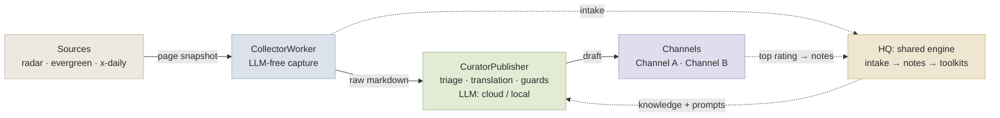
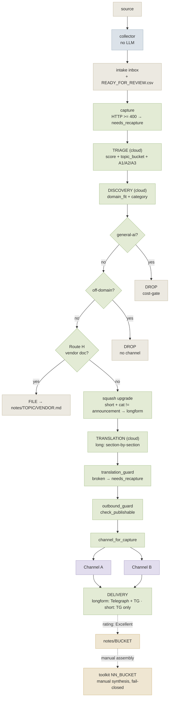
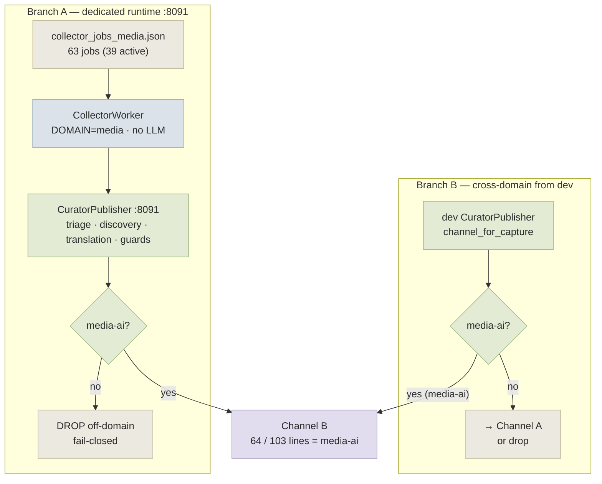

# Case Study: How I Built a Two-Channel AI Scout System

### Dumb collector, smart curator, human taste, living memory

> **Text status:** public case study draft. It describes the architecture and decisions without exposing private runtime state, secrets, logs, raw intake, or internal operational files.
>
> This document also works as a standalone launch article (Dev.to / Medium). If published externally, link it back to the [AI-native Newsroom](../README.md) framework.

I did not set out to build “a news bot.”

The original problem was more practical: AI development moves too quickly. Important details appear in changelogs, research posts, GitHub releases, vendor docs, personal blogs, Telegram posts, and social threads. A human can follow the stream for a while, but the cost compounds. The real loss is not missing a headline; it is missing a pattern that should become part of the working knowledge base.

The result became a two-channel AI scout system:

- **Channel A (AI development)** — AI development and AI-native engineering;
- **Channel B (generative media)** — generative media: image, video, voice, music, creative tools.

Both channels share one architectural idea: collect broadly, judge carefully, publish safely, and promote only the best material into memory.

## The architecture in one diagram

## The original design tension

The project had to solve four tensions at the same time.

| Tension | Bad answer | Better answer |
|---|---|---|
| Freshness vs quality | publish everything fast | separate capture from editorial judgment |
| Automation vs taste | let the model decide taste | keep human rating as the knowledge gate |
| More domains vs more code | fork the project for each topic | make each topic a domain pack |
| Public output vs messy reality | publish whatever the runtime emits | fail closed with guards and recapture queues |

The most important decision was to avoid making the collector smart.

## Decision 1: Keep the collector boring

The collector does not call an LLM. It captures pages and writes raw Markdown. It records source health and capture failures. That is enough.

This prevents early-stage model judgment from contaminating the evidence layer. A broken capture remains a broken capture. A weak source remains inspectable. The editorial layer can make a decision with context instead of inheriting a model’s hidden guess.

## Decision 2: Put judgment in the curator

The curator performs the expensive decisions: topic bucket, domain fit, content shape, category, publication route, translation/editing, guard checks, and final deliverability.

This is where LLMs are useful: not as magical editors, but as structured assistants executing an explicit editorial contract.

## Decision 3: Treat the channel as a product surface

A public channel is not a debug stream. It should not show 404 captures, apology text from a model, broken encoding, repeated paragraphs, empty article shells, or off-domain material.

That is why the system uses multiple gates. Some happen before translation. Some happen before draft writing. Some happen immediately before outbound delivery.

## Channel A pipeline

This diagram shows the path from source to channel: capture, triage, discovery, deterministic drop gates, Route H for vendor docs, longform/shortform handling, translation guard, outbound guard, delivery, and post-publication promotion.

## Decision 4: Make a second domain without forking the system

The second (generative-media) channel is not a separate invention. It is a second domain running on the same principle: different source jobs, different routing, different domain boundaries, same core idea.

The numbers above are real: the generative-media domain runs its own collector registry of **63 source jobs (39 active)** on a dedicated publisher instance (port `:8091`), and **64 of its 103 published posts** arrived through the cross-domain `media-ai` route from the dev runtime rather than from its own collector.

This matters because it proves that the project is not just a single-purpose bot. It is a reusable editorial scaffold.

## Decision 5: Let the knowledge base grow slowly

Publishing is quick. Trust is slow.

Only the strongest published items should become long-term knowledge. In this architecture, the human curator rates posts after publication. The best material is promoted into `notes/`, and later into `knowledge-base/toolkits/` during deliberate synthesis.

That protects the knowledge base from becoming a landfill of everything the system ever touched.

## Scale today

A snapshot of the two live channels, measured directly from the runtime:

| | **Channel A** (AI dev) | **Channel B** (generative media) |
|---|---|---|
| Published posts | 774 | 103 (64 via cross-domain `media-ai`) |
| Active sources / total | 144 / 173 | 39 / 63 |
| Collector lanes | radar 49 · evergreen 118 · x-daily 6 | radar 30 · evergreen 33 |
| Knowledge taxonomy | 11 topic buckets ↔ 11 toolkits | 4 modalities (image · video · voice · music) |
| Truth unit | toolkit-first (the assembled toolkit) | topic-first (the per-modality file) |
| Human-rated positive | 141 excellent + 48 good | 35 excellent (of those rated) |
| Engine | one shared source tree · second `.env` | same source tree, port `:8091` |

The publisher engine is a single codebase serving both channels; the dev and media domains differ only in configuration and knowledge packs.

## Limitations and design trade-offs

A case study that only lists strengths is marketing. Every choice here bought something and cost something. These are **inherent trade-offs of the architecture**, stated honestly, each with the countermeasure the design relies on:

- **One shared engine means a shared blast radius.** The biggest reward — fix the engine once, both domains benefit — is also the biggest risk: a change made for one domain can silently drift the other, especially in the prompt pack and channel identity. The design treats those two as **strictly per-domain, never shared**, and the countermeasures are per-domain smoke tests and a config fingerprint exposed by the health check. Config drift is the failure class to design against from day one, not later.
- **Cross-domain de-duplication is database-local.** A `media-ai` item can reach the media channel from either runtime, and each runtime only de-duplicates within its own database. This is an accepted trade-off; closing it fully means a shared channel-level published ledger.
- **A single cloud model is a single point of fragility.** Running the whole smart layer (triage, discovery, translation) on one model is cheap and simple, but it concentrates both cost and failure. The countermeasures are a degeneration guard before publication (models can collapse into repetition or wrong-script output, and content heavy with non-Latin vendor names is more exposed), a golden-set evaluation gate before any model change, and cost gates that drop noise *before* paying for translation.
- **The knowledge base grows unevenly by design.** Only human-rated "excellent" posts become durable notes, so dense areas get dense and quiet areas stay thin. That is the intended behaviour — slow, deliberate memory — but it means coverage is not uniform across topics.
- **An unattended channel needs backlog discipline.** Publishing without a human in the loop is the point, but it makes a growing triage backlog and capture failures things to watch, with bounded auto-retry rather than unbounded queues.
- **Not every planned content shape survived contact with the topic.** The system was designed for four shapes (longform, short announcement, weekly digest, monthly snapshot); only the first two stayed live, because a stream of a few announcements per day does not aggregate well into digests. The lesson generalizes: **content-shape viability depends on the tempo of the topic, not on the engine.** A slower domain might make the weekly digest the primary shape.

## What I would reuse in another project

1. **Dumb collector / smart curator.** Cheap capture, explicit judgment later.
2. **Domain pack.** Topic-specific rules without forking the runtime.
3. **Fail-closed guards.** If the output is broken, hold it.
4. **Channel vs knowledge separation.** Public feed and long-term memory are different artifacts.
5. **Human rating loop.** Taste becomes a signal, not an invisible preference.
6. **File-first control plane.** Markdown, CSV, YAML, and git make the system legible to humans and agents.

## What this project taught me

The hard part of AI automation is not getting a model to produce text. The hard part is building the small social and technical system around it: what counts as evidence, what gets published, what gets remembered, what gets dropped, who decides, and how the next run becomes better than the previous one.

That is the real architecture.

---

**See also:** [framework overview](../README.md) · [build guide](../GUIDE.md) · [design patterns](patterns.md)
