# AI Agent Editorial Patterns

### Reusable design patterns for AI-assisted publishing and knowledge systems

> **Text status:** pattern reference distilled from the [AI-native Newsroom](../README.md) framework and the two-channel architecture.

This document is not a product walkthrough. It is a pattern catalog: small, reusable ideas that can be applied to AI-assisted newsrooms, research radars, knowledge bases, and domain agents.

The patterns are intentionally practical. Each one exists because a real system needs a decision boundary: what to automate, what to hold, what to publish, what to remember, and what to leave to a human.

```mermaid
flowchart LR
    SRC["Sources<br/>RSS · websites · GitHub · social · APIs"]
    COL["Collector<br/>LLM-free capture"]
    RAW["Intake<br/>raw material"]
    CUR["Curator<br/>triage · taxonomy · format · guards"]
    PUB["Publication<br/>channel · site · newsletter"]
    HUMAN["Human editor<br/>taste · rating · decisions"]
    KB["Knowledge base<br/>notes · rules · toolkits"]

    SRC --> COL --> RAW --> CUR --> PUB --> HUMAN --> KB
    KB -.->|"rules + examples"| CUR

    classDef source fill:#ece9e1,stroke:#c2b89e,color:#2b2b2b
    classDef collector fill:#dbe2e9,stroke:#9fb3c0,color:#2b2b2b
    classDef curator fill:#e3ebd5,stroke:#a3bd86,color:#2b2b2b
    classDef channel fill:#e2ddee,stroke:#a99ec4,color:#2b2b2b
    classDef knowledge fill:#efe6d2,stroke:#cdb47e,color:#2b2b2b
    class SRC,RAW source
    class COL collector
    class CUR curator
    class PUB channel
    class HUMAN,KB knowledge
```



## Pattern index

| # | Pattern | Use when | Core idea |
|---:|---|---|---|
| 1 | Dumb Collector / Smart Curator | sources are messy and numerous | capture first, judge later |
| 2 | Domain Pack | one runtime must support many topics | move expertise into portable rules |
| 3 | Fail-Closed Publishing | public output must stay clean | uncertainty becomes hold/recapture, not publish |
| 4 | Channel ≠ Knowledge Base | feeds move fast, knowledge should be durable | separate delivery from memory |
| 5 | Human Rating Loop | taste matters and cannot be fully specified | ratings become training signals for the system |
| 6 | Route H / File-Only Knowledge | useful material is not always publishable | archive valuable references without spamming the channel |
| 7 | Guarded Translation | LLM output may degrade invisibly | block broken output before draft and before delivery |
| 8 | Toolkit Promotion | repeated lessons should become reusable methodology | synthesize notes into stable toolkits |

## 1. Dumb Collector / Smart Curator

**Problem.** When the collector becomes “smart,” it starts mixing infrastructure work with editorial judgment. Failures become hard to debug.

**Pattern.** Keep collection deterministic and boring. Capture raw material, preserve metadata, and let the curator decide later.

**Why it works.** Capture failures, source quality, and editorial taste become separate problems.

**Use it when:** you collect from RSS, blogs, docs, GitHub, APIs, or social sources and cannot trust every page shape.

## 2. Domain Pack

**Problem.** A new topic often becomes a new code fork.

**Pattern.** Keep the runtime stable and move topic-specific knowledge into a domain pack: promise, audience, sources, taxonomy, gates, examples.

**Why it works.** The system can expand to new domains without multiplying codebases.

```yaml
domain_pack:
  promise: ""
  audience: ""
  sources: []
  taxonomy: {}
  quality_gates: {}
  examples:
    publish: []
    file_only: []
    drop: []
```

## 3. Fail-Closed Publishing

**Problem.** Public channels punish silent failures. A model apology can look like a post. A 404 page can look like source material.

**Pattern.** If the system is not sure that the output is real, readable, in-domain, and publishable, it must hold or recapture instead of publishing.

**Good fail states:** `needs_recapture`, `file_only`, `hold_for_review`, `drop`.

**Bad fail state:** “publish anyway.”

## 4. Channel ≠ Knowledge Base

**Problem.** Feeds are optimized for attention and freshness. Knowledge bases are optimized for reuse and trust.

**Pattern.** Treat a public post and a knowledge note as different artifacts.

**Why it works.** The channel can move quickly without turning the knowledge base into a landfill.

## 5. Human Rating Loop

**Problem.** Taste is hard to encode fully in advance.

**Pattern.** Let the system publish only after guards, but let the human rate published material afterward. Promote only the best material into durable memory.

```text
published post → human rating → excellent items → notes → toolkit synthesis
```

## 6. Route H / File-Only Knowledge

**Problem.** Some material is valuable but not worth a public post: vendor docs, narrow references, routine updates, supporting evidence.

**Pattern.** Route it to files instead of channels.

**Why it works.** The project keeps knowledge without diluting the feed.

## 7. Guarded Translation

**Problem.** LLM translation can fail in subtle ways: repeated phrases, encoding damage, language leakage, missing body, or reasoning artifacts.

**Pattern.** Use guard checks before draft creation and again before outbound delivery.

**Why it works.** The final assembled output is checked as a product surface, not trusted because an earlier step passed.

## 8. Toolkit Promotion

**Problem.** Individual notes are useful, but repeated lessons should become reusable operating doctrine.

**Pattern.** Promote selected notes into stable toolkits only during deliberate synthesis.

**Why it works.** The knowledge base evolves without becoming noisy.

## How to apply these patterns

Start with the pattern that separates your biggest ambiguity:

- If source quality is the problem → start with Dumb Collector / Smart Curator.
- If domain expansion is the problem → start with Domain Pack.
- If public quality is the problem → start with Fail-Closed Publishing.
- If knowledge rot is the problem → start with Channel ≠ Knowledge Base and Toolkit Promotion.

---

**See also:** [framework overview](../README.md) · [build guide](../GUIDE.md) · [real-world case study](case-study.md)
